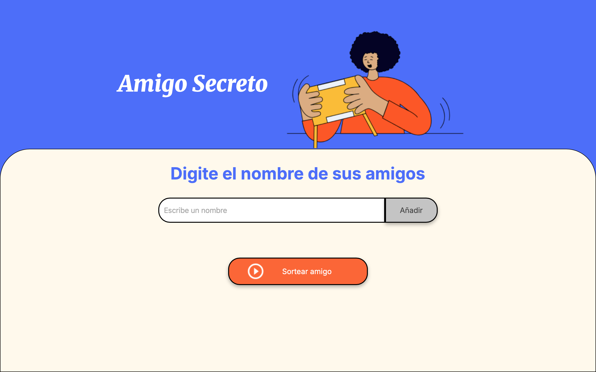

# 🎁 Proyecto: Amigo Secreto

Este proyecto permite ingresar una lista de nombres para un juego de **Amigo Secreto**, y luego selecciona al azar a un amigo secreto para cada participante.

Ideal para organizar dinámicas divertidas entre amigos, familia o compañeros de trabajo.

---

## 📸 Captura de pantalla

---

## 🚀 ¿Cómo funciona?

1. Ingresa los nombres de tus amigos en el campo de texto.
2. Presiona el botón **Añadir amigos** para añadirlos a la lista.
3. Una vez ingresados, presiona **Sortear amigo** y aparecerá el resultado.
---

## 🛠 Tecnologías usadas

- HTML
- CSS
- JavaScript
- Visual Studio Code

---

## 💡 Ideas para mejorar (futuro)

- Evitar que alguien se asigne a sí mismo.
- Enviar resultados por correo o mensaje.
- Añadir animaciones o sonidos festivos.

---

## 👤 Autor

- dailamoss

